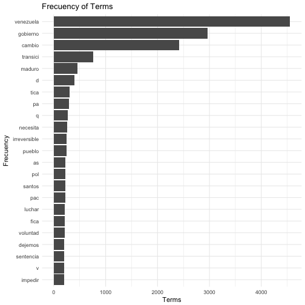
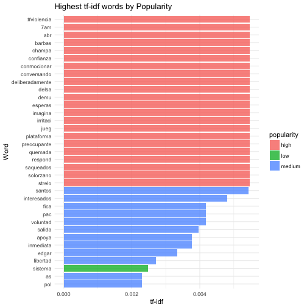

Popular Twits in The Middle of a Political Crisis
========================================================
author: Camacho Jonathan
date: 05/31/2017
autosize: true

Context:
========================================================
- On April 12, 2017, the Venezuelan Supreme Court (SC) announced that it was taking over the Congress' functions; **a juditial coup d'état**. 
- The next day, the President asked the SC to consider retracting from its announcement. 
- That night, the SC did it; **talk about separation of powers** 
- Since then, a large sector of the population declared themselves in rebellion for what they consider as a breakage of the constitutional order. 
       - Protest has not stopped since then: sixty persons have died in the hands of the national police. 

**If you are interested in socila movements this is a nice chance.**

Question:
========================================================

- I wanted to explore, in the middle of the current political crisis, what are the characteristics of the most influential messages in the twiter social media?

- This is an important question related the use of socila media for political mobilization.

Methods:
========================================================
- I created a API to get tweets from 05/01 to 05/28.
       - No geolocation in tweets.
       - Search conducted using the terms "Venezuela," "gobierno," and "cambio."
       - Initial size: 45,000 tweets.
- Tidy data-set
       - Removed re-tweets.
       - Tokenized tweets by words and n-grams.
       - Added new variables: tweet type, and tweet popularity (Construct).
- Final size: 6,445 tweets.
- Translated the "nrc" and "bing" lexicons.

Frequency Analysis
========================================================
#### Total tweets by populatiry. (re-tweets count)


|Populatiry | Total|
|:----------|-----:|
|high       |   201|
|low        | 55283|
|medium     |  1940|

Terms' Frequency Counts.
========================================================


Terms' tf_idf Frequency.
========================================================

One-grams' tf_idf Frequency by Popularity.
========================================================


```
Error in layer(data = data, mapping = mapping, stat = "identity", geom = GeomCol,  : 
  object 'alph' not found
```
