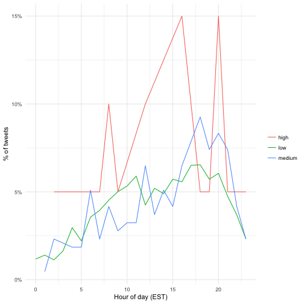
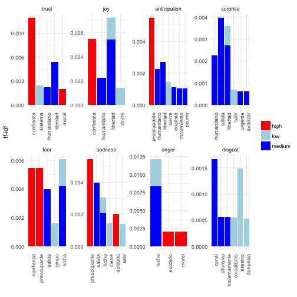
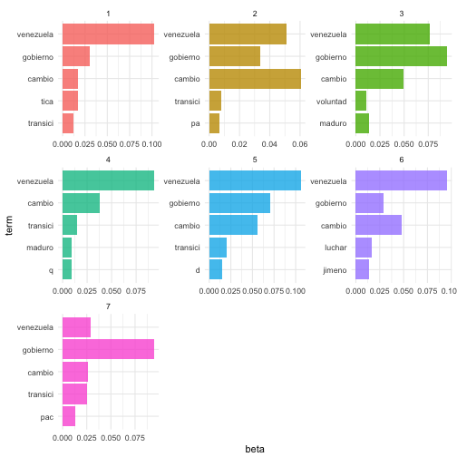

Popular Twits in The Middle of a Political Crisis
========================================================
author: Camacho Jonathan
date: 05/31/2017
autosize: true

Context:
========================================================
- In April 12, 2017, the Venezuelan Supreme Court (SC) trying to take over the function of the Congress (C); a coup d'état. 
- Next day, in a meeting with all the ministers, the president asked the SC to concider retracting its prior desicion. 
- That night, the SC did it. 
- However, a large sector of the population, went to the streets to protest for what they considered as a coup d'état. 
- Protest has not stopped since then.
       - Sixthy persons have died as result of violence during the protests; most of then in hand of the national police. 

Question:
========================================================

- I wanted to explore, In the middle of the current political crisis, what are the charactetistics of the most influencial tweets?

- This is an important question related the use of media for political mobilization.

Methods:
========================================================
- I created a API to get tweets from 05/01 to 05/28.
       - No geolocation in tweets.
       - Search conducted using the terms "venezuela," "gobierno," and "cambio."
       - Initial size: 45,000 tweets.
- Tidy data-set
       - Removed re-tweets.
       - Tokenized tweets by words and n-grams.
       - Added new variables: tweet type, and tweet popularity (Construct).
- Final size: 6,445 tweets.
- Tranlated the "nrc" and "bing" lexicons.

Frequency Analysis
========================================================
#### Total tweets by populatiry. (re-tweets count)

|Populatiry | Total|
|:----------|-----:|
|high       |   201|
|low        | 55283|
|medium     |  1940|

Terms' Frequency Counts.
========================================================

Terms' tf_idf Frequency.
========================================================

One-grams' tf_idf Frequency by Popularity.
========================================================

How to change individualy the x-axis when using "facets."

N-grams' Frecuency Counts. 
========================================================

|Word 1    |Word 2        |word 3    | Total|
|:---------|:-------------|:---------|-----:|
|venezuela |necesita      |gobierno  |   111|
|caracas   |tv            |venezuela |    84|
|radio     |caracas       |tv        |    84|
|tv        |venezuela     |necesita  |    84|
|estado    |más           |crítica   |    76|
|maduro    |prohíbe       |mandar    |    74|
|más       |injerencistas |santos    |    74|
|prohíbe   |mandar        |material  |    72|
|grupo     |transición    |pacífica  |    59|
|violencia |opositora     |forma     |    58|
|libertad  |edgar         |ramírez   |    55|
|mar       |d             |plata     |    49|
|rctv      |venezuela     |necesita  |    43|

N-grams Ranked by tf-idf and Group by Popularity
========================================================

- Figure why popular tweets has more than the selected top 5?
- Print in a better way.

Comparing Tweets by Time Posted.
========================================================

Sentiment Analysis.
========================================================

Topic Modeling.
========================================================

To Work On
========================================================
- Double check lexicons and tokenization process.
- Stilylize plots and charts. 
- Organize files in repo. Righ now is a mess!
- Streamline the code and pipeline.
- Finishing the AFINN lexicon.
- Get more tweets.
- Adding a Shiny app for exploration.
       - Bootstraping the data.
       - Poisson measure.
       - Select tweets acording to populatity and tf-idf score.
- Editing website.

