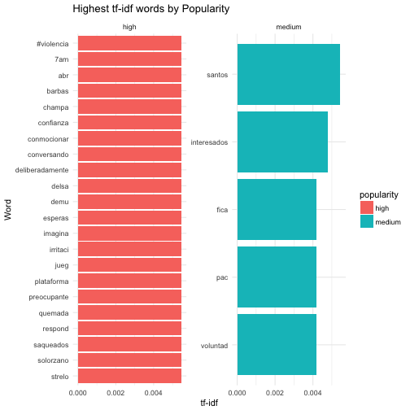
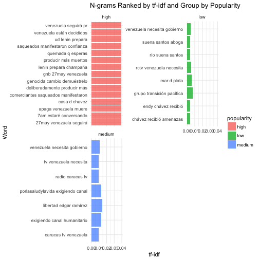

Popular Twits in The Middle of a Political Crisis
========================================================
author: Camacho Jonathan
date: 05/31/2017
autosize: true

Question:
========================================================

- In the middle of the current political crisis, what are the charactetistics of the most Venezuela's most popular tweets?

Context:
========================================================

Methods:
========================================================
- Created a API to get tweets from 05/01 to 05/28.
       - Initial size: 45,000 tweets.
- Tidy dataset
       - Romoved retweets.
       - Tokenized tweets by words and ngrams.
       - Added new variables: tweet type, and tweet popularity.
- Final size: 6,445 tweets. 

Frequency Analysis
========================================================

|Populatiry | Total|
|:----------|-----:|
|high       |   201|
|low        | 55283|
|medium     |  1940|

Terms' Frequency.
========================================================

Terms's tf_idf Frequency.
========================================================

One-grams' tf_idf Frequency.
========================================================

N-grams' Frecuency
========================================================

|Word 1    |Word 2    |word 3    | Total|
|:---------|:---------|:---------|-----:|
|venezuela |necesita  |gobierno  |   111|
|caracas   |tv        |venezuela |    84|
|radio     |caracas   |tv        |    84|
|tv        |venezuela |necesita  |    84|
|estado    |más       |crítica   |    76|
|maduro    |prohíbe   |mandar    |    74|
T
========================================================

